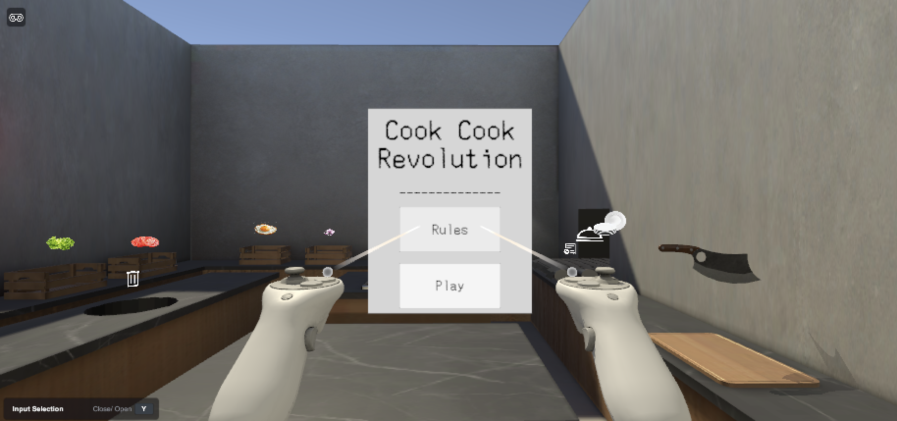
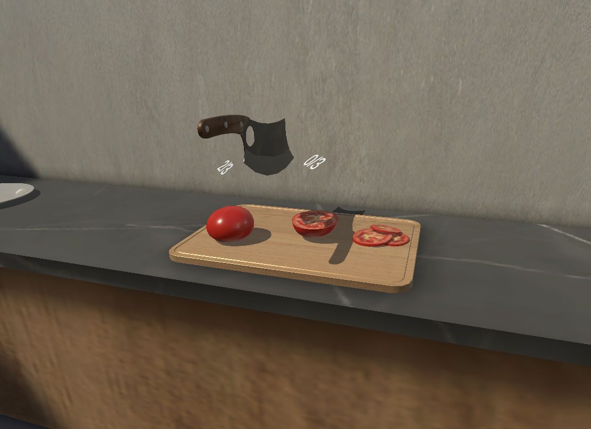
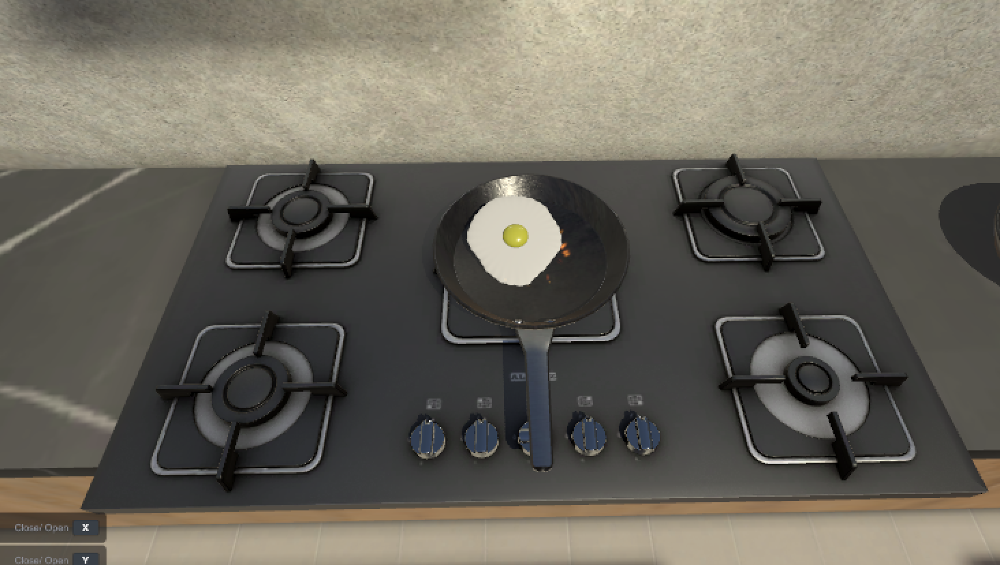
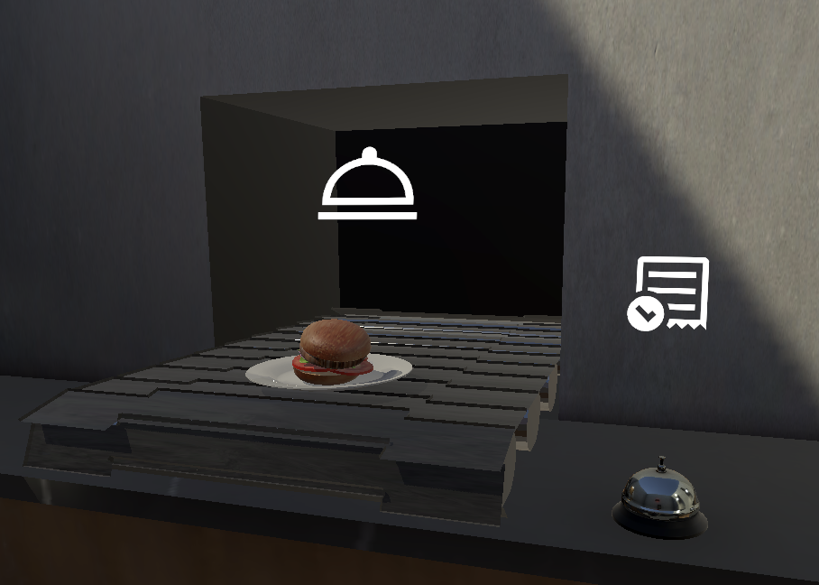
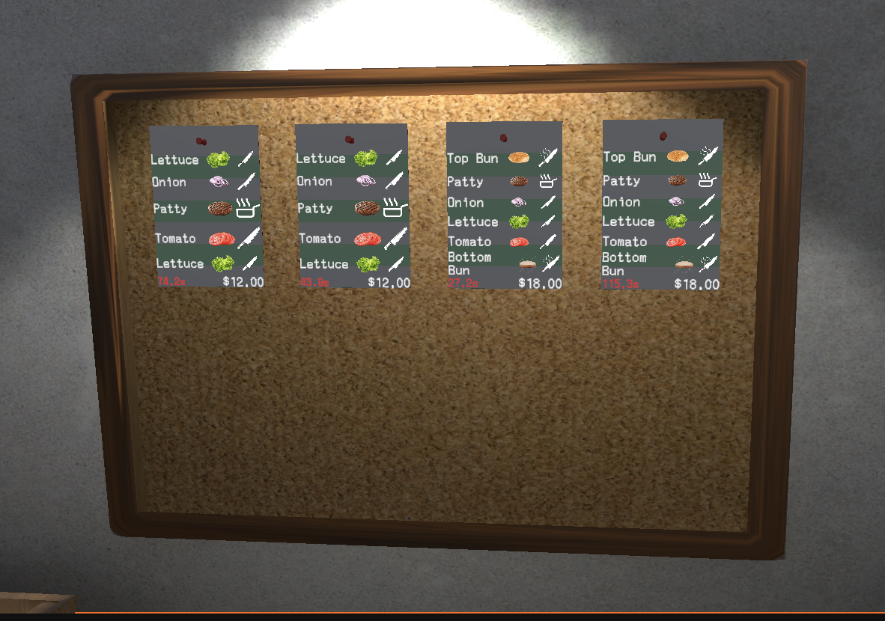

# Cook Cook Revolution

Cook Cook Revolution is a VR cooking game built in Unity. Players prepare ingredients with hand-tracked or controller-based interactions, cook food on a stove, assemble orders, and serve completed dishes before the timer runs out.

## Overview

The game is designed for VR play. It uses Unity's XR Interaction Toolkit so the main interaction model is reaching, grabbing, chopping, cooking, plating, and serving objects directly in 3D space.

This project is not currently documented as a WASD and mouse keyboard game. Earlier desktop-style controls are not part of the current setup, so the README treats the project as a VR-first experience.

## Gameplay

1. Check the order board for active recipes and remaining time.
2. Grab ingredients from the kitchen stations.
3. Chop ingredients on the cutting board when a recipe requires prep work.
4. Cook ingredients on the stove and watch their cooking state.
5. Stack prepared ingredients on a plate.
6. Send completed dishes through the serve area and ring the bell.

## Screenshots

### VR Kitchen

### Chopping Ingredients

### Cooking Station

### Serving Orders

### Order Board

## Features

- VR hand/controller interactions for grabbing, moving, chopping, cooking, plating, and serving.
- Ingredient prep flow with whole, chopped, cooked, and burned food states.
- Physical kitchen stations including cutting board, stove, pan, plate area, conveyor, bell, and trash.
- Order board with timed tickets, ingredient requirements, and payout values.
- Plate stacking and serving validation for completed recipes.
- In-game start, rules, pause, and game-over UI.

## Tech Stack

- Unity 6.3 LTS, `6000.3.6f1`
- Universal Render Pipeline
- XR Interaction Toolkit
- XR Hands
- OpenXR, Meta OpenXR, Oculus XR, and Android XR packages
- Blender-authored kitchen and food assets

## Requirements

- Unity `6000.3.6f1` or a compatible Unity 6.3 LTS editor
- Blender installed locally for importing `.blend` assets
- A VR/XR runtime supported by the configured XR packages
- A compatible VR headset or simulator setup for testing XR interactions

## Opening The Project

1. Open the project folder in Unity Hub.
2. Use Unity `6000.3.6f1` if available.
3. Make sure Blender is installed before the first Unity import so `.blend` models are converted correctly.
4. Open `Assets/Scenes/VR Test Scene (Recovered).unity`.
5. Enter Play Mode with a VR headset or XR simulator configuration.

## Project Notes

- The active scene used for the current screenshots is `VR Test Scene (Recovered)`.
- If prefab or model references appear missing after reinstalling Blender, close Unity, delete the project's `Library` folder, then reopen the project so Unity can reimport the Blender assets.
- The current controls are VR-focused. Keyboard and mouse movement is not presented as the intended gameplay path.
